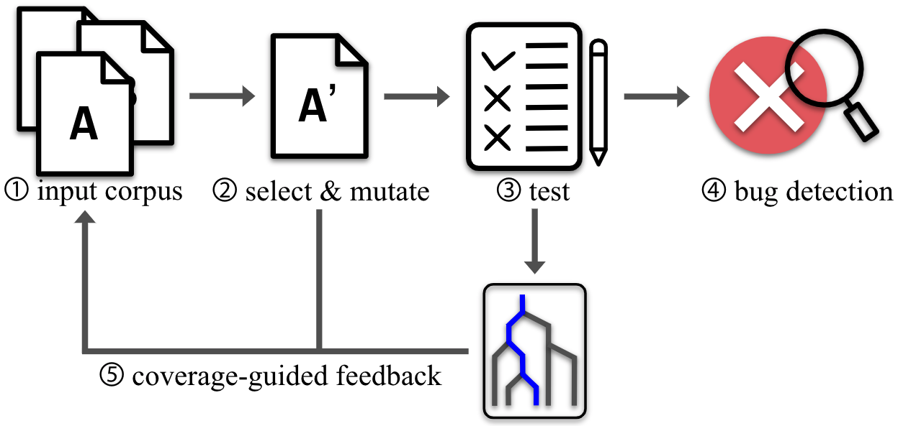

# AFL++ tutorial: How to crash Rescript parser

This post is a tutorial of [AFL++](https://aflplus.plus/)[^aflpp], one of famous fuzzing tools which has detected dozens of software bugs. In this post, we utilize this fuzzer to crash the [parser](https://github.com/rescript-lang/syntax) of [Rescript](https://rescript-lang.org/) compiler. Motivated by [this](https://forum.rescript-lang.org/t/compiler-testing-via-fuzzing/3306/3), implying there might be bugs which can be caught with primary fuzzing techniques, I started my first bug hunt hoping it would help this young language system to be more mature.

## Background

This section explains basic concept of evolutionary fuzzing which is a mainstream of fuzzing technique. You can use AFL++ without reading this explanatory section, so if you don't mind how the fuzzer struggles with finding bug you can skip this and go to [Setup](#setup) directly.

<figure>
  <center></center>
  <center><figcaption> Figure 1. Evolutionary Fuzzing </figcaption></center>
</figure>

Figure 1 is a brief summary of evolutionary fuzzing. 'Evolutionary' means, the fuzzer evolves by updating input corpus so that it can start another iteration based on known, effective start point. An input is regarded as useful if it found a new coverage, and added to input corpus. Many state-of-the-art fuzzers including [AFL](https://lcamtuf.coredump.cx/afl/) and [LibFuzer](https://llvm.org/docs/LibFuzzer.html) have adopted this strategy. For each interation in Figure 1,

1. Fuzzing starts with user provided inputs, which comply with proper input type of PUT(program under test). In our case, they should be Rescript source files.
2. Select one input from input corpus, and randomly mutate in byte-level.
3. Execute PUT with the mutated input.
4. If PUT crashes, detect a bug by tracing PUT with given input.
5. If the mutated input explores new coverage, add it to input corpus.

To recognize whether an input explores previously uncovered code, we should know what part of source code is explored during program execution with given input. To do that, the source code of PUT should be recompiled with instrumentation. In other words, inserting extra code in order that program execution outputs additional coverage information. Many languages are providing compilers which instrument source codes in compile time, including Ocaml.

## Setup

There are 3 components to be installed. FYI, I've been using Ubuntu 20.04.
- [Install AFL++](#install-afl)
- [Install (AFL version of) Ocaml compiler](#install-afl-version-of-ocaml-compiler)
- [Install Rescript parser](#install-rescript-parser)

#### Install AFL++

- You can build AFL++ from source([instruction](https://github.com/AFLplusplus/AFLplusplus/blob/stable/docs/INSTALL.md)).
- Alternatively, you can install AFL++ using apt-get.
  ```sh
  sudo apt-get update
  sudo apt-get -y install afl++
  ```

#### Install (AFL version of) Ocaml compiler 

1. Install Opam, the Ocaml package manager([instruction](https://opam.ocaml.org/doc/1.1/Quick_Install.html)).
2. Find available AFL version of Ocaml compiler by command below.
   ```sh
   opam swith list-available
   ```
   I chose `4.11.2+afl` version.
3. Create switch by command below.
   ```sh
   opam switch create <switch-name> 4.11.2+afl
   ```
4. Update shell environment.
   ```sh
   eval $(opam env)
   ```

#### Install Rescript parser

Install Rescript parser([instruction](https://github.com/rescript-lang/syntax#setup--usage-for-repo-devs-only)). (AFL version of)Ocaml compiler automatically instruments parser source codes so that its coverage can be measured by AFL++.
   > **Note**
   > In this post, previous commit(af00a46042c76ca8342dd6857ebe8776de00200c) is used instead of latest to reproduce this [bug](https://github.com/rescript-lang/syntax/pull/540).
   > If you want to follow, checkout to that commit before building.


Assuming that Rescript parser is cloned under `$HOME`, The parser binary, which is the target of fuzzing, would be located in
`~/syntax/_build/default/cli/res_cli.exe`.

## Prepare Fuzzing Inputs

Gather valid inputs for PUT, and minimize input corpus by removing redundant inputs whose coverages are not unique. A study[^seedselection] demonstrated empirically that the input seeds have a critical impact on fuzzing performance, and recommended to use large & unique input seeds.

#### Collect Rescript source files

Gather Rescript repositories in a directory and copy only rescript sources.
1. Make a directory `rescript_projs` under `$HOME`.
   ```sh
   cd ~
   mkdir rescript_projs
   ```
2. Clone any available Rescript repositories. You can find a variety of Rescript repos in [LibHunt](https://www.libhunt.com/l/rescript). Or, using just Rescript parser repository is a good choice as there are quite a lot of Rescript sources including testing inputs.
   ```sh
   cd rescript_projs
   git clone git@github.com:rescript-lang/syntax.git
   # clone any Rescript repositories you want.
   ```
3. Copy only Rescript sources into another directory `rs_files`.
   ```sh
   cd ~
   mkdir rs_files
   find rescript_projs -type f \( -name "*.res" -o -name "*.resi" \) | xargs cp -t rs_files/
   ```

#### Minimize input corpus

Gathered source files in `rs_files` should be minimized so that only unique inputs are left. As mentioned above, an input is 'unique' if its coverage is new. Intuitively, fuzzer would stick to exploring similar codes rather than searching diversely if there were lots of duplicates. This step is done by AFL++, with instrumented target program.
```sh
afl-cmin -i ~/rs_files -o ~/rs_files_unique -- ~/syntax/_build/default/cli/res_cli.exe  @@
```
This command copies uniques inputs from `rs_files` to `rs_files_unique`, which is also created automatically. `@@` is a place holder where a fuzzed input is supposed to be.

You can see more than half of sources from Rescript parser repo were thrown away, through this minimization process.
```sh
$ ls ~/rs_files | wc -l
1069
$ ls ~/rs_files_unique | wc -l
496
```

## Do Fuzzing

Start fuzzing by typing a command below. Again, `fuzz_report`, directory for report is created automatically.
```sh
afl-fuzz -i ~/rs_files_unique -o ~/fuzz_report -- ~/syntax/_build/default/cli/res_cli.exe  @@
```
You will see an interface that shows fuzzing status.

Crashing inputs can be found in `~/fuzz_report/crashes`.

You can manually crash the parser with found crashing inputs, like
```sh
~/syntax/_build/default/cli/res_cli.exe ~/fuzz_report/crashes/<crashing input>
```

To trace a call stack for debuggin, execute parser with setting ocaml environment variable.
```sh
export OCAMLRUNPARAM=b
~/syntax/_build/default/cli/res_cli.exe ~/fuzz_report/crashes/<crashing input>
```

## Conclusion

AFL++ was able to find previously unknown bugs of Rescript parser. Moreover, it seems that there are still rooms for this tool to play an important role. The reason why this general fuzzing tool works well comes from the fact that the input type of parser is 'string', which has a simple, one-dimensional structure. Therefore naive application of this tool to Rescript compiler won't work because byte-level mutation of AFL++ would probably make input source code invalid, leading to failure in parsing process.

[^aflpp]: A community-maintained version of [AFL](https://lcamtuf.coredump.cx/afl/), which equips additional features and enhancements.
[^seedselection]: Herrera et al., "Seed selection for successful fuzzing". ISSTA 2021. https://doi.org/10.1145/3460319.3464795